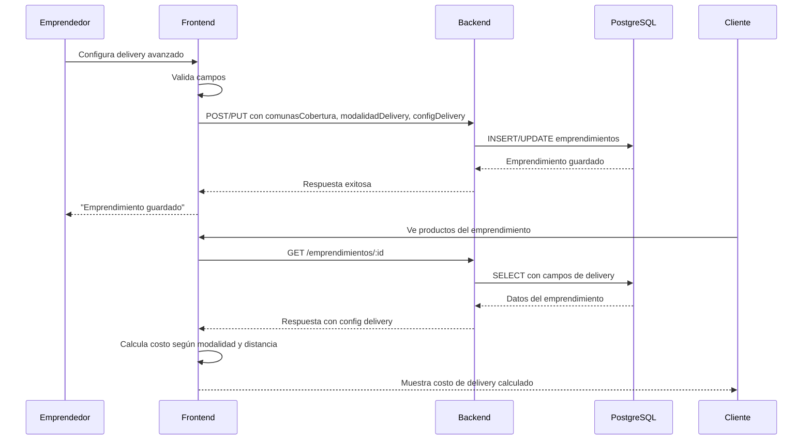

# 🚚 Sistema Avanzado de Delivery

## 📅 Fecha de Implementación
**Noviembre 9, 2025**

---

## 🎯 Descripción General

Se implementó un sistema completo de delivery avanzado que permite a los emprendedores:

1. **Seleccionar comunas de cobertura** donde realizan entregas
2. **Elegir entre 4 modalidades de cobro** de delivery:
   - **Gratis**: Sin costo para el cliente
   - **Gratis desde monto mínimo**: Gratis si el pedido supera cierto monto
   - **Por distancia**: Cobro variable según 3 rangos de distancia
   - **Costo fijo**: Mismo precio para todas las entregas
3. **Cálculo automático** del costo de delivery en tiempo real

---

## 🗄️ Cambios en Base de Datos

### Migración SQL: `AGREGAR_DELIVERY_AVANZADO.sql`

Se agregaron **3 columnas** a la tabla `emprendimientos`:

| Columna                | Tipo      | Default       | Descripción                                                                 |
|------------------------|-----------|---------------|-----------------------------------------------------------------------------|
| `comunas_cobertura`    | `JSONB`   | `[]`          | Array de nombres de comunas. Ej: `["Santiago", "Providencia"]`             |
| `modalidad_delivery`   | `VARCHAR(50)` | `NULL`    | Modalidad: `'gratis'`, `'gratis_desde'`, `'por_distancia'`, `'fijo'`       |
| `config_delivery`      | `JSONB`   | `{}`          | Configuración según modalidad (montos, rangos, costos)                     |

**Índice creado:**
```sql
CREATE INDEX idx_emprendimientos_modalidad_delivery ON emprendimientos(modalidad_delivery);
```

---

## 📊 Estructura de Datos

### `comunas_cobertura` (Array de strings)
```json
["Santiago", "Providencia", "Las Condes", "Ñuñoa"]
```

### `modalidad_delivery` (String)
Valores posibles:
- `"gratis"`
- `"gratis_desde"`
- `"por_distancia"`
- `"fijo"`

### `config_delivery` (Objeto según modalidad)

#### 1️⃣ Modalidad: `gratis`
```json
{}
```

#### 2️⃣ Modalidad: `gratis_desde`
```json
{
  "montoMinimo": 15000
}
```

#### 3️⃣ Modalidad: `por_distancia`
```json
{
  "rango1_km": 2,
  "rango1_costo": 1000,
  "rango2_km_desde": 2,
  "rango2_km_hasta": 5,
  "rango2_costo": 2000,
  "rango3_km": 5,
  "rango3_costo": 3000
}
```

#### 4️⃣ Modalidad: `fijo`
```json
{
  "costoFijo": 2500
}
```

---

## 🔧 Cambios en Backend

### Archivo: `src/routes/emprendimientos.js`

#### 1. GET `/api/emprendimientos/mis-emprendimientos` (Autenticado)
**Actualizado para devolver:**
- `comunas_cobertura`
- `modalidad_delivery`
- `config_delivery`

#### 2. GET `/api/emprendimientos` (Público)
**Actualizado para devolver:**
- `comunas_cobertura`
- `modalidad_delivery`
- `config_delivery`

#### 3. POST `/api/emprendimientos` (Crear)
**Acepta nuevos campos en el body:**
```javascript
{
  // ... campos existentes
  "comunasCobertura": ["Santiago", "Providencia"],
  "modalidadDelivery": "por_distancia",
  "configDelivery": {
    "rango1_km": 2,
    "rango1_costo": 1000,
    // ...
  }
}
```

#### 4. PUT `/api/emprendimientos/:id` (Actualizar)
**Acepta nuevos campos en el body:**
- Actualiza directamente si está en estado `verificacion`
- Crea borrador con los nuevos campos si ya está activo

#### 5. POST `/api/emprendimientos/:id/verificar-codigo` (Verificar)
**Actualizado para copiar los nuevos campos:**
- Al aplicar un borrador, copia `comunas_cobertura`, `modalidad_delivery` y `config_delivery` al emprendimiento original

---

## 🎨 Cambios en Frontend

### Archivo: `veciApp/screens/EmprendimientoScreen.js`

#### Estados nuevos:
```javascript
const [comunasCobertura, setComunasCobertura] = useState([])
const [modalidadDelivery, setModalidadDelivery] = useState('fijo')
const [configDelivery, setConfigDelivery] = useState({
  costoFijo: '',
  montoMinimo: '',
  rango1_km: '',
  rango1_costo: '',
  rango2_km_desde: '',
  rango2_km_hasta: '',
  rango2_costo: '',
  rango3_km: '',
  rango3_costo: ''
})
```

#### UI de selección de comunas:
- Selector multi-selección con chips visuales
- Iconos de checkmark cuando está seleccionado
- Validación: mínimo 1 comuna si delivery está activo

#### UI de modalidades de delivery:
- Radio buttons modernos para seleccionar modalidad
- Inputs dinámicos según modalidad elegida
- Validaciones específicas por modalidad

### Archivo: `veciApp/screens/PedidoDetalleScreen.js`

#### Función: `obtenerCostoDelivery(producto)`
Calcula el costo de delivery según la modalidad:

```javascript
// Extrae distancia del string "2.5 km"
const distancia = parseFloat(distanciaText.match(/[\d.]+/)?.[0]) || 0

switch (producto.modalidad_delivery) {
  case 'gratis':
    return 0
  
  case 'gratis_desde':
    if (subtotal >= config.montoMinimo) return 0
    // Fallback a costo fijo si no cumple el mínimo
    return costo_delivery || 1500
  
  case 'por_distancia':
    if (distancia <= config.rango1_km) return config.rango1_costo
    if (distancia <= config.rango2_km_hasta) return config.rango2_costo
    return config.rango3_costo
  
  case 'fijo':
    return config.costoFijo
  
  default:
    return costo_delivery || 1500
}
```

#### Modal de confirmación:
Muestra información detallada del delivery:
- Distancia al local
- Costo de delivery calculado
- Mensaje "¡Gratis!" en verde si aplica

---

## ✅ Validaciones Implementadas

### Frontend (`EmprendimientoScreen.js`):

```javascript
// Validación de comunas
if (tipos_entrega.delivery) {
  if (!comunasCobertura || comunasCobertura.length === 0) {
    toast.error('Debes seleccionar al menos una comuna de cobertura')
    return
  }
  
  if (!modalidadDelivery) {
    toast.error('Debes seleccionar una modalidad de delivery')
    return
  }
  
  // Validaciones por modalidad
  switch (modalidadDelivery) {
    case 'gratis_desde':
      if (!configDelivery.montoMinimo) {
        toast.error('Ingresa el monto mínimo para delivery gratis')
        return
      }
      break
    
    case 'por_distancia':
      if (!configDelivery.rango1_km || !configDelivery.rango1_costo ||
          !configDelivery.rango2_km_desde || !configDelivery.rango2_km_hasta ||
          !configDelivery.rango2_costo || !configDelivery.rango3_km ||
          !configDelivery.rango3_costo) {
        toast.error('Completa todos los rangos de distancia y costos')
        return
      }
      break
    
    case 'fijo':
      if (!configDelivery.costoFijo) {
        toast.error('Ingresa el costo fijo del delivery')
        return
      }
      break
  }
}
```

---

## 🧪 Ejemplos de Uso

### Ejemplo 1: Delivery Gratis
```json
{
  "nombre": "Pizzeria Michelle",
  "tipos_entrega": { "delivery": true, "retiro": true },
  "comunasCobertura": ["Santiago", "Providencia"],
  "modalidadDelivery": "gratis",
  "configDelivery": {}
}
```
**Resultado:** Todos los pedidos tienen delivery gratis.

---

### Ejemplo 2: Gratis desde $15.000
```json
{
  "nombre": "Almacén Don Juan",
  "tipos_entrega": { "delivery": true },
  "comunasCobertura": ["Santiago", "Ñuñoa", "Macul"],
  "modalidadDelivery": "gratis_desde",
  "configDelivery": {
    "montoMinimo": 15000
  }
}
```
**Resultado:**
- Pedido de $20.000 → Delivery **gratis**
- Pedido de $10.000 → Delivery **$1.500** (costo_delivery por defecto)

---

### Ejemplo 3: Por Distancia
```json
{
  "nombre": "Pastelería La Francesa",
  "tipos_entrega": { "delivery": true },
  "comunasCobertura": ["Santiago", "Providencia", "Las Condes"],
  "modalidadDelivery": "por_distancia",
  "configDelivery": {
    "rango1_km": 2,
    "rango1_costo": 1000,
    "rango2_km_desde": 2,
    "rango2_km_hasta": 5,
    "rango2_costo": 2000,
    "rango3_km": 5,
    "rango3_costo": 3500
  }
}
```
**Resultado:**
- Cliente a **1.5 km** → Delivery **$1.000**
- Cliente a **3.0 km** → Delivery **$2.000**
- Cliente a **7.0 km** → Delivery **$3.500**

---

### Ejemplo 4: Costo Fijo
```json
{
  "nombre": "Restaurant El Buen Sabor",
  "tipos_entrega": { "delivery": true },
  "comunasCobertura": ["Santiago"],
  "modalidadDelivery": "fijo",
  "configDelivery": {
    "costoFijo": 2500
  }
}
```
**Resultado:** Todos los pedidos tienen delivery de **$2.500** sin importar la distancia.

---

## 📝 Flujo Completo



---

## 🚀 Testing

### Verificar migración:
```sql
SELECT 
  id, nombre, 
  comunas_cobertura, 
  modalidad_delivery, 
  config_delivery 
FROM emprendimientos 
WHERE id = 3;
```

### Probar en Frontend:
1. Ir a **EmprendimientoScreen**
2. Activar "Delivery"
3. Seleccionar comunas de cobertura
4. Elegir modalidad de delivery
5. Ingresar configuración según modalidad
6. Guardar emprendimiento
7. Ir a **PedidoDetalleScreen**
8. Verificar que el costo de delivery se calcule correctamente

---

## 📦 Archivos Modificados

### Backend:
- ✅ `AGREGAR_DELIVERY_AVANZADO.sql` (nuevo)
- ✅ `src/routes/emprendimientos.js`
- ✅ `SISTEMA_DELIVERY_AVANZADO.md` (nuevo, este archivo)

### Frontend:
- ✅ `veciApp/screens/EmprendimientoScreen.js`
- ✅ `veciApp/screens/PedidoDetalleScreen.js`

---

## 🎨 Estilos y UX

### Selector de Comunas:
- Chips con bordes y fondo cuando están seleccionados
- Icono de checkmark verde cuando está activo
- Scroll horizontal si hay muchas comunas
- Color primario del tema (`currentTheme.primary`)

### Radio Buttons de Modalidad:
- Diseño moderno con círculo y checkmark interior
- Color primario cuando está seleccionado
- Título en negrita, descripción en gris
- Animación suave al cambiar

### Inputs de Configuración:
- Prefijo "$" para campos monetarios
- Sufijo "km" para distancias
- Validación en tiempo real
- Borde rojo si hay error

---

## 🐛 Posibles Issues y Soluciones

### Issue 1: "No se guarda la configuración"
**Causa:** Validación fallando en frontend
**Solución:** Verificar que todos los campos requeridos estén llenos según la modalidad

### Issue 2: "El costo de delivery no se calcula"
**Causa:** El producto no tiene `modalidad_delivery` o `config_delivery`
**Solución:** Verificar que el emprendimiento se guardó correctamente con los nuevos campos

### Issue 3: "Error al aplicar borrador"
**Causa:** El UPDATE del borrador no incluye los nuevos campos
**Solución:** Ya implementado en línea 1299-1351 de `emprendimientos.js`

---

## 🔮 Mejoras Futuras

1. **Historial de cambios** de configuración de delivery
2. **Estadísticas** de delivery (promedio de costos, distancias)
3. **Notificación al cliente** si el delivery sube de precio
4. **Descuentos** en delivery para clientes frecuentes
5. **Delivery compartido** entre pedidos cercanos
6. **Mapa interactivo** para visualizar zonas de cobertura

---

## 👨‍💻 Desarrollado por
**VeciApp Team** - Noviembre 2025

---

## 📞 Soporte
Si tienes dudas sobre esta implementación, contacta al equipo de desarrollo.

---

**¡Sistema de Delivery Avanzado Completado! 🎉**

